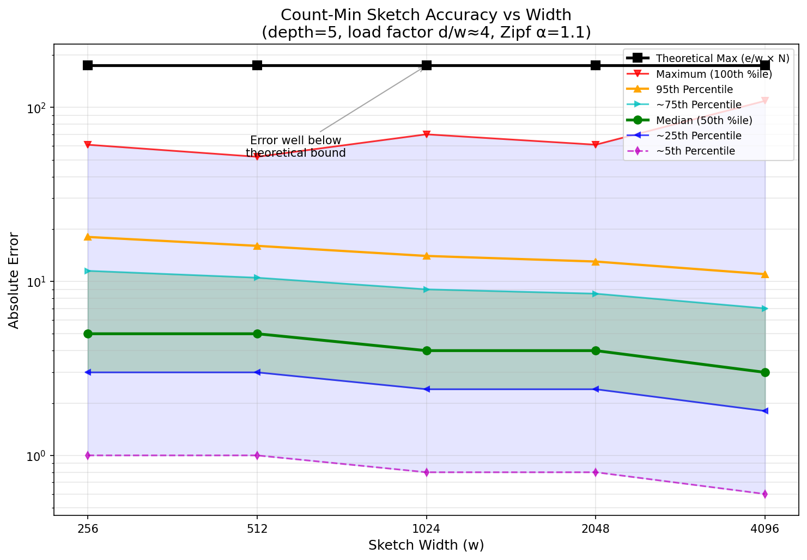
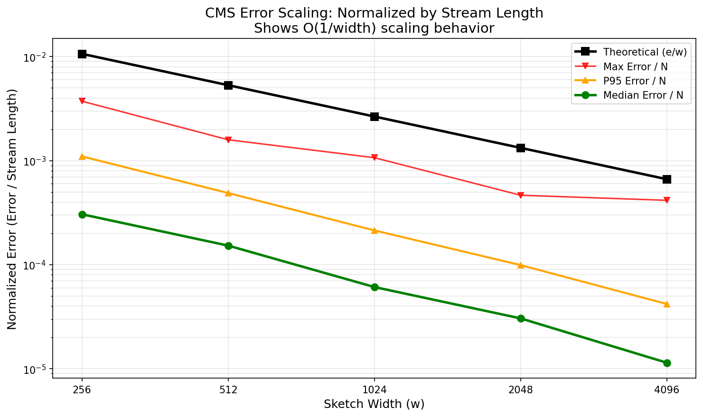

# Count-Min Sketch Accuracy Characterization

## Experiment Design

This profile measures CMS frequency estimation accuracy across different sketch widths (256 to 4096) while maintaining a **constant load factor** (distinct items / width ≈ 4).

### Why Constant Load Factor?

When comparing sketches of different widths, we need them operating in the same regime:

| Width | Distinct Items | Stream Weight | Load Factor | Theoretical Bound |
|-------|---------------|---------------|-------------|-------------------|
| 256   | 1,024         | 16,384        | 4           | 174               |
| 512   | 2,048         | 32,768        | 4           | 174               |
| 1024  | 4,096         | 65,536        | 4           | 174               |
| 2048  | 8,192         | 131,072       | 4           | 174               |
| 4096  | 16,384        | 262,144       | 4           | 174               |

**The theoretical bound ε×N = (e/w)×N stays constant because stream weight scales with width.**

This is intentional: it ensures fair comparison by keeping all sketches in the same collision regime (not comparing an overloaded small sketch vs a sparse large sketch).

### Key Finding

Empirical errors are **well below** the theoretical worst-case bound across all widths, and remain roughly constant. This demonstrates that CMS performs consistently relative to its guarantees regardless of scale—a width-2048 sketch at load factor 4 behaves similarly to a width-1024 sketch at load factor 4.

The normalized plot shows error/weight scales as O(1/width), confirming the theoretical relationship.

